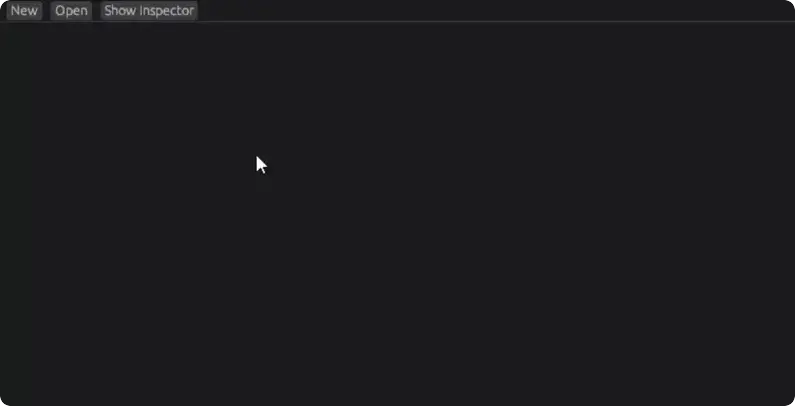

<p align="center">
  <picture>
    <source media="(prefers-color-scheme: dark)" srcset="./assets/logo_light.png">
    <source media="(prefers-color-scheme: light)" srcset="./assets/logo_dark.png">
    
  </picture>
</p>

**Gearbox** is state machine/chart library for the [Bevy](https://bevyengine.org/) game engine.

[](#license)
[](https://crates.io/crates/bevy_gearbox)
[](https://docs.rs/bevy_gearbox)

---

## Design

- **ECS driven.** States and transitions are simple entities, react to changes via observers. If you know bevy, you know gearbox.
- **Ergonomic API.** Focus on your logic, not in learning a new library.
- **Data driven.** Easily manage state machines as assets if you want to.
- **[Visual Editor.](https://github.com/DEMIURGE-studio/bevy_gearbox_editor)** (optional) Easily build, edit and monitor your state machines.

<p align="center">
  
</p>

The goal of gearbox is simple. You should be able to interact with it exactly like you interact with anything else in bevy.
Building a state machine is as simple as spawning entities.
Querying for entities in a particular state is as simple as adding a `With<ExampleComponent>` to the end of a query.
Reacting to a transition between two states with just `On<EnterState>` in the observer.

## Table of Contents
<details>
<summary>Click to expand</summary>

- [Getting Started](<#Getting started>)
- [Features](<#Features>)
  - [State Machines](<#State Machines>)
  - [State Charts](<#State Charts (Nested state machines)>)
  - [States](<#States>)
  - [Transitions](<#Transitions>)
  - [Triggering transitions](<#Triggering transitions>)
  - [Transition-triggered events](<#Transition-triggered events>)
  - [Statemachine-wide systems](<#Statemachine-wide systems>)
- [Your first State Machine/Chart](<#Your first State Machine/Chart>)
- [Using the editor (optional)](<#Using the editor (optional)>)
  - [Installing the editor](<#Installing the editor>)
  - [Creating an state machine in the editor](<#Creating an state machine in the editor>)
- [Future goals](<#Future goals>)
- [Potential Footgun](<#POTENTIAL FOOTGUN>)
- [Version Table](<#Version Table>)
- [Contributing](<#Contributing>)
- [License](<#License>)

</details>

## Getting started
1. Run `cargo add bevy_gearbox`
2. Add `GearboxPlugin` to your app:
```rust
use bevy::prelude::*;
use bevy_gearbox::GearboxPlugin;

fn main() {
    let mut app = App::new();

    app.add_plugins((
        DefaultPlugins,
        GearboxPlugin,
    ));

    app.run();
}
```

## Features

### State Machines
```rust
commands.spawn((
  Name::new("My State Machine"),
  InitialState(ready),
  StateMachine::new(),
));
```

### State Charts (Nested state machines)
```rust
// TODO: Simple statechart example
```

### States
```rust
commands.spawn((
  Name::new("Ready"),
  StateChildOf(my_state_machine),
));
commands.spawn((
  Name::new("NotReady"),
  StateChildOf(my_state_machine),
));
```

### Transitions
```rust
#[derive(SimpleTransition, EntityEvent, Clone)]
struct SetNotReady(Entity);
commands.spawn((
  Name::new("Ready -> Not Ready"),
  Source(ready),
  Target(not_ready),
  EventEdge::<SetNotReady>::default(),
));

#[derive(SimpleTransition, EntityEvent, Clone)]
struct SetReady(Entity);
commands.spawn((
  Name::new("Not Ready -> Ready"),
  Source(not_ready),
  Target(ready),
  EventEdge::<SetReady>::default(),
));
```

### Triggering transitions
```rust
  // "My State Machine" is Ready
  commands.entity(p).trigger(SetNotReady)
  // "My State Machine" is NotReady
```

### Transition-triggered events
```rust
commands
    .entity(not_ready)
    .observe(on_enter_not_ready);

fn on_enter_not_ready(
    on: On<EnterState>,
    entities: Query<Entity, With<NotReady>>,
) {
    let Ok(on.state_machine) = entities.get(on.state_machine) else {
      return
    };

    info!("Entered NotReady state!");
}
```

### Statemachine-wide systems
```rust
fn count_ready_entities(
    entities: Query<Entity, With<Ready>>,
) {
    info!(ready_count = entities.iter().count());
}
```

## Your first State Machine/Chart
Inside [DOCS.md](DOCS.md) you'll find an in-depth step by step guide into everything you need to build your first
State Machine/Chart, interact with it through the ECS and explanations for every mechanism there's to it.
Don't worry, gearbox is pretty simple and intuitive to use, so it isn't as daunting as it sounds!

<!-- TODO: Maybe move this section and everything regarding to the
editor into the editor repository and link to it.-->
## Using the editor (optional)

### Installing the editor
1. Run `cargo add bevy_gearbox_editor bevy_egui bevy-inspector-egui`
2. Add `GearboxEditorPlugin`, `EguiPlugin` and `DefaultInspectorConfigPlugin` to your app
```rust
use bevy::prelude::*;
use bevy_gearbox::GearboxPlugin;
use bevy_gearbox_editor::GearboxEditorPlugin;
use bevy_inspector_egui::bevy_egui::EguiPlugin;
use bevy_inspector_egui::DefaultInspectorConfigPlugin;

fn main() {
    let mut app = App::new();

    app.add_plugins((
        DefaultPlugins,
        GearboxPlugin,
        GearboxEditorPlugin,
        EguiPlugin::default(),
        DefaultInspectorConfigPlugin,
    ));

    app.run();
}
```
3. Run your app `cargo run`
4. press `ctrl-o` to start the editor

> [!NOTE]  
> Reworking the editor to be a standalone process that uses BRP to inspect your app at runtime
> is a future goal, and should make adding and using the editor much more straightforward. 

### Creating an state machine in the editor
Coming soon.

## Future goals
- Improve usability and erogonomics
  Through user experimentation new edgecases and api ergonomic gotchas are bound to be discovered and improved.
- Integrate with `bsn!` and `Scenes V2`
  This will make defining state machines in code much more powerful, and the entity patching will massively improve usability of statemachine scene assets. Fingers crossed for 0.18!
- Use inventory more liberally to get rid of other component registration requirements, such as for state components and parameters.
- Make the editor completely standalone through [BRP](https://docs.rs/bevy/0.17.2/bevy/remote) (Bevy Remote Protocol).

> [!WARNING]  
> # POTENTIAL FOOTGUN
> When manually building state machines through commands it is important to add the StateMachine component to your root last.
> This initializes the machine, and if you don't add the StateMachine to the root after you've added all your InitialState
> components to other state entities, it will not initialize correctly. The proper "layout" for building statechart entities
> is demonstrated in the repeater example. This is not a problem if you use a scene to spawn your statechart.
> You can author statechart scenes using the [editor](https://github.com/DEMIURGE-studio/bevy_gearbox_editor).
> In the future this will be solved by building state machines through bsn.
>
> **TLDR:** Insert the StateMachine component as the last one of the State Machine entity.

## Version Table
| Bevy    | Gearbox |
| ------- | ------ |
| 0.17    | 0.4    |
| 0.16    | 0.3*    |

<sup><sub>Versions below 0.4 are unsupported due to a huge crate rewrite.</sub></sup>

## Contributing

Feel free to open issues or create pull requests, if you encounter any problems.

Ask us on the [Bevy Discord](https://discord.com/invite/bevy) server's [Gearbox topic](https://discord.com/channels/691052431525675048/1379511828949762048) in `#ecosystem-crates` for larger changes or other things if you feel like so!

## License
Bevy gearbox is free and open source. All code in this repository is dual-licensed under either:

- MIT License ([LICENSE-MIT](/LICENSE-MIT) or <http://opensource.org/licenses/MIT>)
- Apache License, Version 2.0 ([LICENSE-APACHE](/LICENSE-APACHE) or <http://www.apache.org/licenses/LICENSE-2.0>)

at your option.